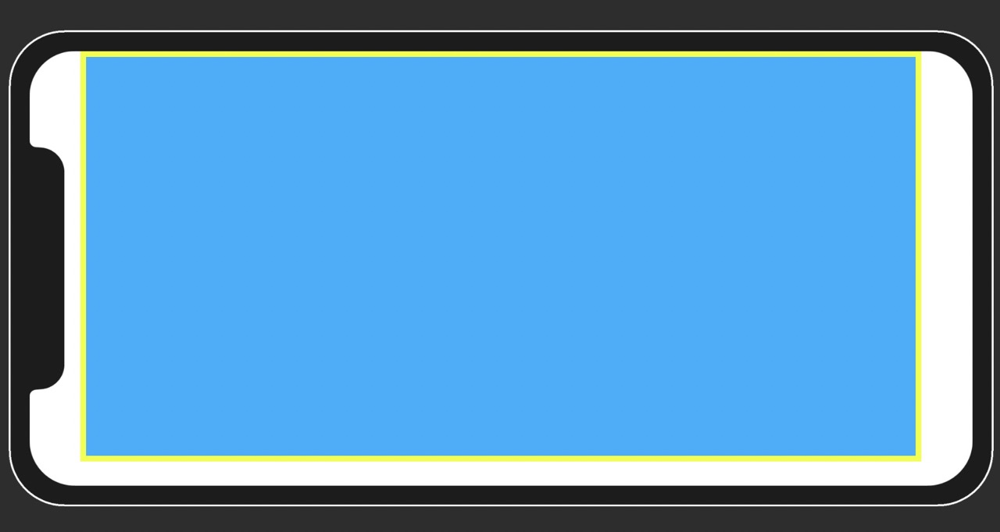
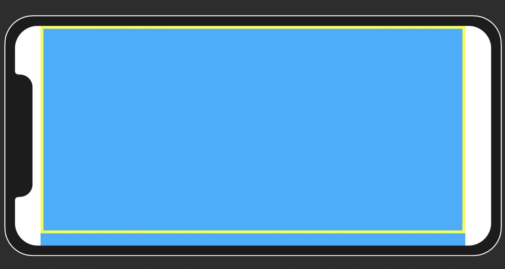
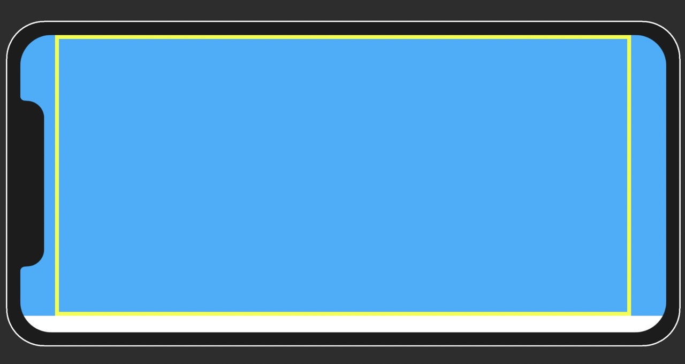
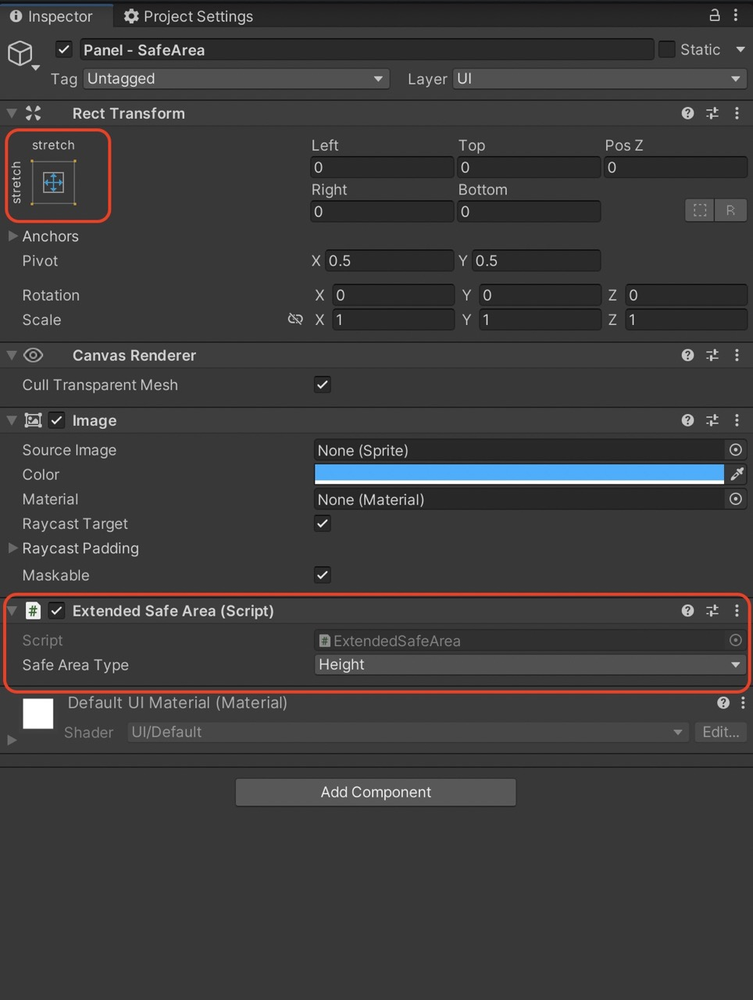

# ExtendedSafeArea
Safe area plugin with extended options for Unity 3D.

### Options
- Full Screen.
- Width.
- Height.

##Full Screen - Safe Area

##Safe Area Width

##Safe Area Area

##Guide

Add a full stretch panel and add "Extended Safe Area" script as shown in below image. (Safe area is applied on runtime so please hit play to see the results.)

